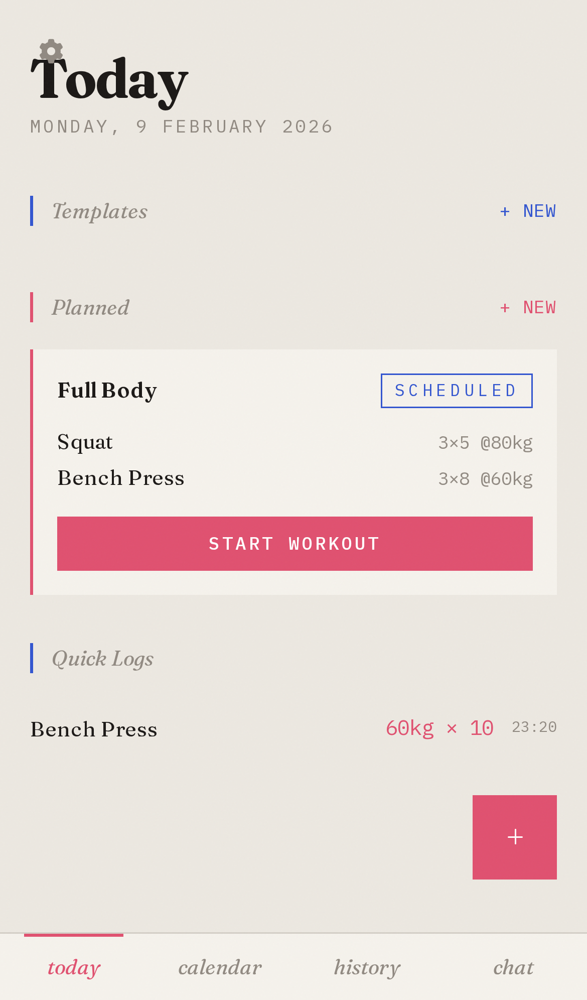
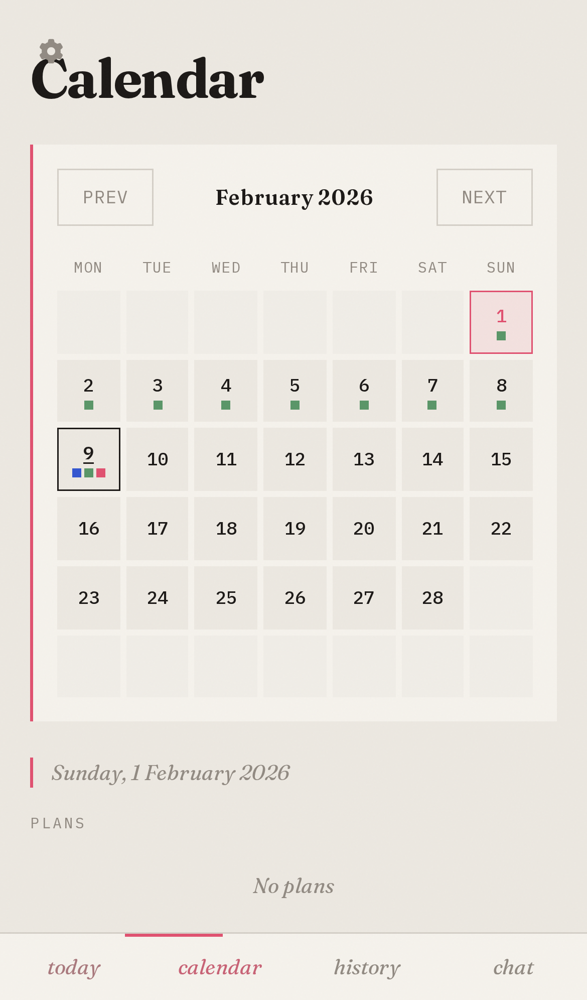
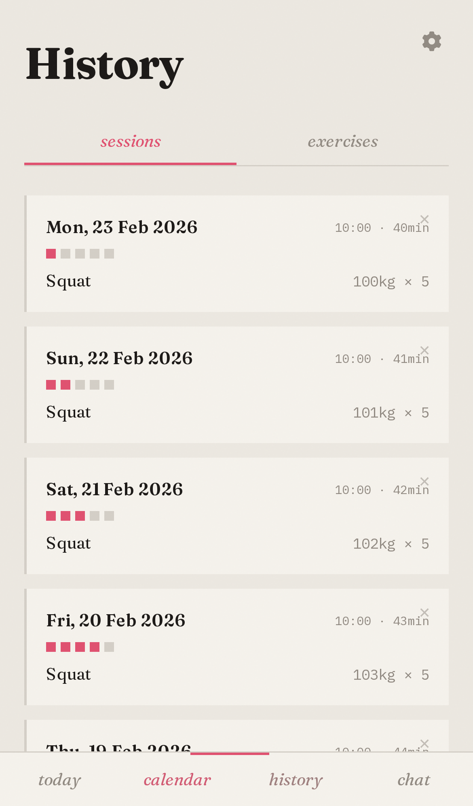
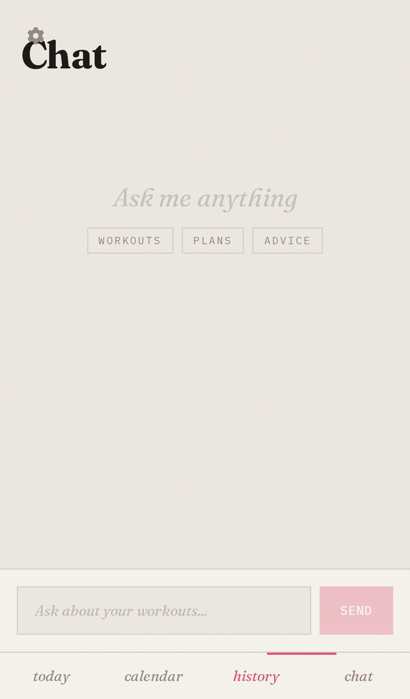

# MDBase Workouts

Implementation repository for the MDBase Workouts app, backed by an `mdbase` markdown collection.

This project is an implementation of [mdbase-spec](https://github.com/callumalpass/mdbase-spec).

## Repository purpose

- Provide a working app that stores and queries workout data from markdown files with YAML frontmatter.
- Exercise spec-defined concepts in code: collection config, type definitions, validation, queries, links, and CRUD operations.
- Serve as an implementation example, not the normative spec.

## Architecture

- Frontend: React + Vite + TypeScript + Tailwind (`src/`)
- Backend API: Hono on Node (`server/`)
- Data engine: `@callumalpass/mdbase`
- Storage: local markdown files under `data/`
- Optional chat endpoint: Claude Agent SDK streaming over SSE

## Why `mdbase` works well with Claude tooling

- `mdbase` gives the app a typed API (`query`, `read`, `create`, `update`, `delete`) over plain markdown files, so backend code can enforce structure without moving data into a separate database.
- The same records remain directly readable as files (`data/**/*.md`), which means Claude Code can inspect and edit them with normal file tools.
- In `server/routes/chat.ts`, Claude Agent SDK runs with `cwd` set to `data/` and file-oriented tools enabled (`Read`, `Write`, `Edit`, `Glob`, `Grep`), so chat operations happen against the same source-of-truth files used by the app.
- Type definitions in `data/_types/*.md` keep the collection shape explicit for both programmatic access (`mdbase`) and agent/file-based workflows.

## Frontend features 

- Today tab: today’s plans, sessions, quick logs; create plan; log workout; quick log entry
- Calendar tab: month grid + per-day session list
- History tab: paginated sessions and exercise search; exercise detail view with stats, edit form, and history timeline
- Chat tab: streaming assistant responses with local history/session persistence

## Mobile screenshots

Generated with Playwright (`npm run screenshots`) and stored in `docs/screenshots/`.

### Today



### Calendar



### History



### Chat



## Data layout

Collection root: `data/`

- Config: `data/mdbase.yaml`
- Type definitions: `data/_types/*.md`
- Records:
  - `data/exercises/*.md`
  - `data/plans/*.md`
  - `data/sessions/*.md`
  - `data/quick-logs/*.md`

Cross-record references are stored as wikilinks, for example `[[exercises/bench-press]]`.

## API

Base path: `/api`

- `GET /api/health`
- `GET /api/exercises`
- `GET /api/exercises/:slug`
- `POST /api/exercises`
- `PUT /api/exercises/:slug`
- `DELETE /api/exercises/:slug`
- `GET /api/exercises/:slug/history`
- `GET /api/sessions?limit=&offset=`
- `GET /api/sessions/:id`
- `POST /api/sessions`
- `PUT /api/sessions/:id`
- `DELETE /api/sessions/:id`
- `GET /api/plans?status=`
- `GET /api/plans/:id`
- `POST /api/plans`
- `PUT /api/plans/:id`
- `DELETE /api/plans/:id`
- `GET /api/quick-logs?limit=`
- `POST /api/quick-logs`
- `GET /api/today`
- `POST /api/chat/message` (SSE)

## Requirements

- Node.js 18+
- npm
- Optional for chat endpoint: Anthropic API key in environment

## Setup

Install dependencies:

```bash
npm install
```

Run frontend + backend in dev mode:

```bash
npm run dev
```

Default local endpoints:
- frontend: `http://localhost:5173`
- backend: `http://localhost:3002`

Vite proxies `/api` requests to the backend.

## Seed data

Populate starter exercises (skips files that already exist):

```bash
npm run seed
```

## Tests

Run tests once:

```bash
npm test
```

Watch mode:

```bash
npm run test:watch
```

Run Playwright end-to-end tests:

```bash
npm run test:e2e
```

Current e2e coverage (`tests/app.e2e.spec.ts`):
- tab navigation (today, calendar, history, chat)
- quick log flow (create + payload assertion)
- plan creation flow (exercise selection + payload assertion)
- session logger flow (set completion + metadata + payload assertion)
- history pagination and exercise filtering
- calendar loading and chat streaming flow (including clear/reset)

Regenerate mobile screenshots:

```bash
npm run screenshots
```

## Production run

Build and start:

```bash
./start.sh
```

Equivalent commands:

```bash
npm run build
npm start
```

In production (`NODE_ENV=production`), the backend serves static files from `dist/`.

## Scripts

- `npm run dev` - start frontend and backend concurrently
- `npm run dev:fe` - start frontend only
- `npm run dev:be` - start backend only
- `npm run build` - build frontend assets
- `npm test` - run Vitest
- `npm run test:watch` - run Vitest in watch mode
- `npm run test:e2e` - run Playwright tests
- `npm run screenshots` - capture mobile screenshots to `docs/screenshots/`
- `npm run seed` - seed exercise markdown records
- `npm start` - start backend in production mode

## Scope note

This repository is an application-level POC. `../mdbase-spec` remains the source of truth for normative behavior and conformance definitions.
